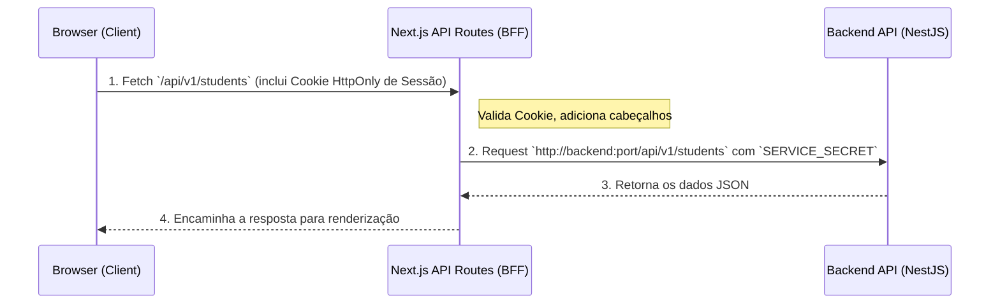

# 01. Arquitetura e Padrão BFF (Backend for Frontend)

O repositório `vrg-transport-employee-frontend` é construído com Next.js 16 e adota estritamente o padrão **BFF (Backend for Frontend)**. Isso significa que o navegador (cliente) **nunca** faz requisições diretas para o `vrg-transport-backend` (a API NestJS).

Neste documento, detalharemos como essa arquitetura funciona, seus componentes fundamentais e a motivação por trás desse design.

## O que é o BFF e por que usamos?

Numa arquitetura tradicional SPA (Single Page Application), o frontend envia requisições HTTP do navegador direto para a API. Isso requer lidar com CORS complexos, expor tokens JWT no navegador (localStorage ou cookies expostos), e expor detalhes da API.

No **Padrão BFF adotado no VRG Transport**:
1. O navegador se comunica **exclusivamente** com o servidor Next.js (rodando em Node.js).
2. O servidor Next.js recebe essas requisições e as **repassa (proxy)** para a API backend (NestJS).
3. A comunicação entre o Next.js e o NestJS ocorre no lado do servidor, em uma rede interna, sendo autenticada através de um segredo (o `SERVICE_SECRET`).

### Vantagens:
- **Segurança Máxima:** Tokens sensíveis e a URL do backend real ficam ocultos do usuário final.
- **Cookies Seguros:** Usamos cookies `HttpOnly` para armazenar o ID da sessão. O JavaScript no navegador não consegue ler ou adulterar esses cookies, mitigando ataques XSS.
- **Tratamento Específico:** Podemos interceptar respostas, tratar erros ou combinar dados no Next.js antes de enviar ao navegador.

## O Fluxo de uma Requisição (Arquitetura)

## Os Componentes do BFF no Código

Para que essa engrenagem funcione, o repositório emprega diretórios e arquivos vitais:

### 1. `src/app/api/v1/[...path]/route.ts` (O Proxy Dinâmico)
Todas as requisições de dados da UI apontam para `/api/v1/...`. Este endpoint no Next.js pega o resto do caminho (`[...path]`), anexa a URL base do backend (`API_URL` do `.env`) e faz o repasse transparente dos dados, incluindo métodos (GET, POST, PATCH, DELETE) e body.

### 2. Rotas de Autenticação (`src/app/api/auth/...`)
As requisições de login não são simplesmente redirecionadas. Elas caem em endpoints específicos:
- `/api/auth/login`: Manda as credenciais para o backend. Se validado, o backend retorna um ID de Sessão. O Next.js então cria os cookies criptografados `HttpOnly` no navegador e responde com sucesso.
- `/api/auth/logout`: Invalida a sessão no backend e limpa os cookies no navegador do cliente.
- `/api/auth/session`: Verifica no backend se o cookie de sessão atual ainda é válido.

### 3. Middleware (`src/proxy.ts` - Antigo `middleware.ts`)
O Next.js emprega um arquivo de Edge Middleware, configurado para interceptar requisições. 
No nosso projeto ele funciona assim:
- Intercepta páginas solicitadas no navegador.
- Lê o cookie `SID` e a `Role` (`admin` ou `employee`).
- Se não estiver logado e a rota for privada, manda para `/login`.
- Se logado, garante que a role do usuário permita acessar a rota solicitada (ex.: Um `employee` não pode acessar `/admin/...`).
- Evita que usuários logados voltem para a tela de login desnecessariamente.

## Variáveis de Ambiente Críticas

Para a arquitetura funcionar, o ambiente do Node.js (`.env.local`) precisa das seguintes chaves:
- `SERVICE_SECRET`: Chave simétrica compartilhada com o `vrg-transport-backend`. O NestJS rejeita requisições do frontend que não possuam esta chave no header `x-service-secret`.
- `NEXT_PUBLIC_API_URL`: URL base local do frontend.
- `API_URL`: Endereço de rede onde o NestJS backend está rodando.

## Regras de Ouro
- **NUNCA** faça chamadas com `fetch` ou Axios do Frontend apontando para `http://backend...` (URL real da API). Tudo precisa bater em `/api/v1/...` no próprio Next.js.
- **NUNCA** salve dados sensíveis em `localStorage`. A sessão deve viver exclusivamente em cookies `HttpOnly`.
